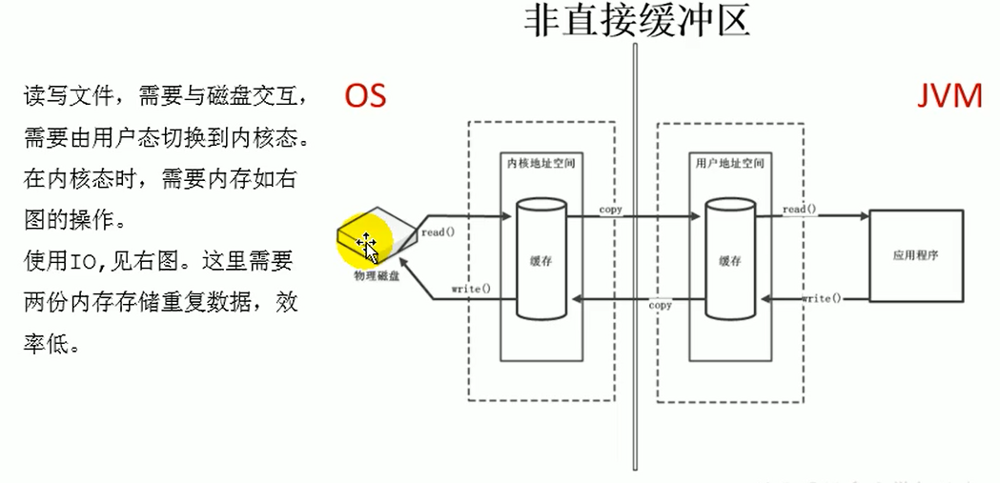
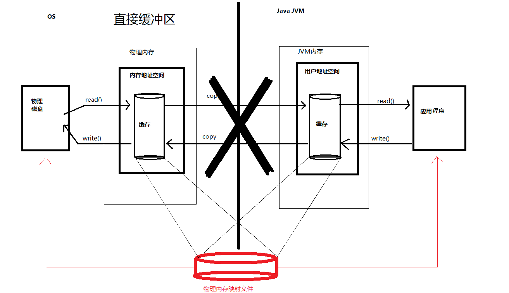

# 深入理解Java虚拟机
## 5 调优案例分析与实战

### 5.3 Eclipse运行速度调优

#### 1. 准备工作

>eclipse版本：2021-09(4.21)
>jdk: openjdk-11-jdk
>需提前安装visualvm，并添加visualGC插件
>eclipse插件：[StartTime](https://github.com/fenixsoft/jvm_book/blob/master/src/org/fenixsoft/jvm/chapter5/EclipseStartTime_1.0.0.201011281102.jar)，下载后放置到`ECLIPSE_PATH/plugins/`目录下。
>虚拟机参数配置：在`ECLIPSE_PATH/eclipse.ini`中，进行如下配置：
>
>> 删除`-XX:+UseG1GC`和`plugins/org.eclipse.justj.openjdk.hotspot.jre.full.linux.x86_64_16.0.2.v20210721-1149/jre/bin`
>>
>> 添加jdk路径为`/usr/lib/jvm/java-11-openjdk-amd64/bin/`
>>
>> 添加GC参数为`-XX:+UseSerialGC`，即采用Serial+Serial Old(MSC)收集器
>>
>> 添加`-Dcom.sun.management.jmxremote`参数以启用JMX管理（从而在VisualVM中收集原始数据）。

#### 2. 基本测试结果

多次启动获得测试结果如下：

>启动时间：稳定在7500ms附近（用VisualVM监测时会上升到8500ms）
>
>最后一次启动时，垃圾收集耗时310 ms，共6次
>
>> Minor GC 3次，耗时100 ms,
>>
>> Full GC 3次，耗时210 ms
>
>加载类9946个，耗时4663 ms
>
>即时编译时间15224 ms
>
>堆内存划分：共256 M，其中新生代85 M（Eden 68 M, 两个Survivor各8.5 M），老年代62 M。

#### 3. 优化类加载时间

取消字节码验证前的类加载时间：

```
Loaded  Bytes  Unloaded  Bytes     Time   
 12654 26565.9        0     0.0       8.02
```

取消字节码验证（添加`-Xverify:none`参数）后的类加载时间：

```
Loaded  Bytes  Unloaded  Bytes     Time   
 11152 23342.9        0     0.0       6.01
```

取消后，启动时间最大下降1s，达到6500 ms，平均略微超过7000 ms。

另外，关闭即时编译（添加`-Xint`参数）后，启动时间高达20000 ms，说明Hotspot的即时编译功能是很有用的。

#### 4. 调整内存设置以控制垃圾收集频率

##### 4.1. 减少 Full GC

添加一些参数用于输出启动过程中发生的GC事件详情：

```
-verbose:gc
-Xlog:gc*,safepoint:gc.log:time,uptime
```

以下为某次测试过程中发生的垃圾收集事件：

```
[1.526s][info][gc] GC(0) Pause Young (Allocation Failure) 68M->14M(247M) 42.195ms
[1.923s][info][gc] GC(1) Pause Full (Metadata GC Threshold) 31M->16M(247M) 43.528ms
[3.695s][info][gc] GC(2) Pause Young (Allocation Failure) 84M->27M(247M) 27.092ms
[3.800s][info][gc] GC(3) Pause Full (Metadata GC Threshold) 30M->27M(247M) 70.599ms
[4.934s][info][gc] GC(4) Pause Young (Allocation Failure) 95M->38M(247M) 29.296ms
[6.125s][info][gc] GC(5) Pause Young (Allocation Failure) 106M->44M(247M) 27.049ms
[6.820s][info][gc] GC(6) Pause Full (Metadata GC Threshold) 57M->46M(247M) 142.959ms
```

> 此处需要声明一些关于元空间的知识：元空间是在JDK1.8中出现的，取代了JDK1.7中的永生代空间。此前的永生代空间的确可以通过`-XX:PermGenSize=`设置初始容量。但元空间的扩容是Hotspot内部通过一些复杂的逻辑进行的，默认的容量是跟系统内存相关的，无法改变；名称类似的`-XX:MetaspaceSize=`参数设置的不是metaspace容量，而是metaspace经过若干次扩容后若达到该值，则触发一次Full GC，对整个内存进行垃圾回收。随后MetaspaceSize会由虚拟机控制，进而在再次达到该值时触发Full GC。[^4]

可以看出，由于默认设置的触发Full GC的元空间容量太小，导致发生了多次Full GC，这几次Full GC回收的空间微乎其微，却耗费了大量时间（每次超过0.1s）。

通过添加`-XX:+PrintFlagsInitial`参数，输出默认的虚拟机参数，发现元空间容量设置如下：

```
   size_t MetaspaceSize                            = 21810376                               {pd product} {default}
```

即默认设置是21M。通过VisualVM中的Monitor>Metaspace页签观察也发现经过几次扩容后已经达到了75.125 M（注意在Visual GC页签中，Metaspace后的数字为(1.016 M, 75.125 M)，这里的1.016G并非Metaspace的当前容量，而是允许虚拟机对Metaspace扩容能达到的最大容量；75.125 M才是当前容量，其他参数同理）。说明初始触发Full GC的容量太小。

查询资料后发现，初始的触发Full GC的元空间容量设置参数为：`-XX:MetaspaceSize=128M`，设置该参数以提高触发Full GC的元空间容量阈值。

再次测试后发现已经没有Full GC事件发生。

删除日志输出参数重新测试，发现最低启动时间没有明显下降，但平均启动时间已经基本稳定在6800 ms左右。

##### 4.2. 减少Minor GC的次数

从上面的垃圾回收过程还可以看出，发生了数次Minor GC，最大的时候是新生代占用100M时发生了Young GC。但之前也提到“堆内存划分：共256 M，其中新生代85 M（Eden 68 M, 两个Survivor各8.5 M），老年代62 M“，也就是Eden加1个Survivor共76.5 M可以作为一次Minor GC的空间。

通过提高`-Xms256M`参数，可以增大使用的内存空间，从而增大Eden区、Survivor区，能够适度减少发生Minor GC的次数。但是相应的，容量增大会导致单次停顿时间变长。例如设置`-Xms1024M`使得Eden区变为273 M时，Minor GC次数减少到了1次，但单次停顿时间也长达100多ms。

查看VisualVM发现，发生的几次Minor GC中，都是新生代已经满了，然后清除掉绝大部分对象，并将少部分（约6M/次）的年龄提升。由于Survivor区只有8M，根据”3.8.4节 动态对象年龄判定“得出，6M已经超过了8M的一半，因此直接将这6M的对象复制晋升到老年代。

针对这样的情况，理论上有两种思路：

1. 增大Survivor区的相对容量（默认的Eden: Survivor1: Survivor2=8:1:1，对应参数为`-XX:SurvivorRatio=8`），通过将该参数调小来增大Survivor区的容量。
2. 减少Survivor区的相对容量。由于上述的动态对象年龄判定的特点，减少Survivor区容量后，每次Minor GC后预备提升年龄的对象总容量会更可能大于Survivor区的一半，从而直接进入老年代而非Survivor区，节省一次复制的时间。（这是因为Appel式收集法每次使用Eden区和一个Survivor区来分配对象，另一个Survivor用于在GC时作为存活对象的复制位置。因此Minor GC时一般会发生一次复制，而在晋升到老年代时又会发生一次复制）。

通过固定新生代容量（`-Xmn96m`），将SurvivorRatio从4（一个Survivor为16 M）到8（一个Survivor为9.5 M）之间来回变动，发现对结果的影响很小，说明上述猜想错误，少量的对象复制对GC停顿时间的影响微乎其微。

##### 4.3. 选择收集器降低延迟

通过测试多种收集器发现G1、CMS+ParNew、Serial等收集器对延迟及停顿的影响很小，基本都在300 ms以内，整体启动时间也已经稳定在7000ms以内，可见启动的性能已经基本不受GC的影响，达到了较好的水平。

## 6. 类文件结构

### 6.3. Class类文件的结构

JVM规范定义的结构[^3]：

```java
ClassFile {
    u4             magic;
    u2             minor_version;
    u2             major_version;
    u2             constant_pool_count;
    cp_info        constant_pool[constant_pool_count-1];
    u2             access_flags;
    u2             this_class;
    u2             super_class;
    u2             interfaces_count;
    u2             interfaces[interfaces_count];
    u2             fields_count;
    field_info     fields[fields_count];
    u2             methods_count;
    method_info    methods[methods_count];
    u2             attributes_count;
    attribute_info attributes[attributes_count];
}
```

编译下面的文件，用特殊的文件编辑器打开（比如hex editor 或者 binary editor），可以看到每个字节的内容。

```java
package jvm;

public class TestClass {
    private int m;
    public int inc(){
        return m+1;
    }
}
```

或者使用javap直接解析class文件，可以直接得到上面每一项的具体内容：

```sh
javap -verbose TestClass
```

> 以下是openjdk-21的编译结果
>
> 常量池里的索引都是指向其他常量的
>
> ```java
> Classfile /home/sw/Documents/study/target/classes/jvm/TestClass.class
>   Last modified Mar 27, 2024; size 361 bytes
>   SHA-256 checksum caca2461961a31a42428b8a88e8e8acc1309a4aea8ed5936cbf363f297b5d7db
>   Compiled from "TestClass.java"
> public class jvm.TestClass
>   minor version: 0
>   major version: 65
>   flags: (0x0021) ACC_PUBLIC, ACC_SUPER
>   this_class: #8                          // jvm/TestClass
>   super_class: #2                         // java/lang/Object
>   interfaces: 0, fields: 1, methods: 2, attributes: 1
> Constant pool:
>    #1 = Methodref          #2.#3          // java/lang/Object."<init>":()V
>    #2 = Class              #4             // java/lang/Object
>    #3 = NameAndType        #5:#6          // "<init>":()V
>    #4 = Utf8               java/lang/Object
>    #5 = Utf8               <init>
>    #6 = Utf8               ()V
>    #7 = Fieldref           #8.#9          // jvm/TestClass.m:I
>    #8 = Class              #10            // jvm/TestClass
>    #9 = NameAndType        #11:#12        // m:I
>   #10 = Utf8               jvm/TestClass
>   #11 = Utf8               m
>   #12 = Utf8               I
>   #13 = Utf8               Code
>   #14 = Utf8               LineNumberTable
>   #15 = Utf8               LocalVariableTable
>   #16 = Utf8               this
>   #17 = Utf8               Ljvm/TestClass;
>   #18 = Utf8               inc
>   #19 = Utf8               ()I
>   #20 = Utf8               SourceFile
>   #21 = Utf8               TestClass.java
> {
>   public jvm.TestClass();
>     descriptor: ()V
>     flags: (0x0001) ACC_PUBLIC
>     Code:
>       stack=1, locals=1, args_size=1
>          0: aload_0
>          1: invokespecial #1                  // Method java/lang/Object."<init>":()V
>          4: return
>       LineNumberTable:
>         line 3: 0
>       LocalVariableTable:
>         Start  Length  Slot  Name   Signature
>             0       5     0  this   Ljvm/TestClass;
> 
>   public int inc();
>     descriptor: ()I
>     flags: (0x0001) ACC_PUBLIC
>     Code:
>       stack=2, locals=1, args_size=1
>          0: aload_0
>          1: getfield      #7                  // Field m:I
>          4: iconst_1
>          5: iadd
>          6: ireturn
>       LineNumberTable:
>         line 6: 0
>       LocalVariableTable:
>         Start  Length  Slot  Name   Signature
>             0       7     0  this   Ljvm/TestClass;
> }
> SourceFile: "TestClass.java"
> ```

#### 6.3.1. 魔数和版本号

魔法数字(001-003): `CA FE BA BE`

次版本号(004-005): `00 00`

主版本号(006-007): `00 41`，也就是65，代表jdk21。


#### 6.3.2. 常量池

##### 常量池容量

容量(008-009): `16`，即十进制的22，表示总共有21个常量（1-21），而**第0个表示空**。


##### 常量池（数组）

| Constant Kind                 | Tag  | Meaning                  |
| ----------------------------- | ---- | ------------------------ |
| `CONSTANT_Class`              | 7    | 类/接口的符号引用        |
| `CONSTANT_Fieldref`           | 9    | 字段的符号引用           |
| `CONSTANT_Methodref`          | 10   | 类中方法的符号引用       |
| `CONSTANT_InterfaceMethodref` | 11   | 接口中方法的符号引用     |
| `CONSTANT_String`             | 8    | 字符串类型字面量         |
| `CONSTANT_Integer`            | 3    | 整型字面量               |
| `CONSTANT_Float`              | 4    | 浮点型字面量             |
| `CONSTANT_Long`               | 5    | 长整型字面量             |
| `CONSTANT_Double`             | 6    | 双精度浮点型字面量       |
| `CONSTANT_NameAndType`        | 12   | 字段或方法的部分符号引用 |
| `CONSTANT_Utf8`               | 1    | UTF-8编码的字符串        |
| `CONSTANT_MethodHandle`       | 15   | 方法句柄                 |
| `CONSTANT_MethodType`         | 16   | 方法类型                 |
| `CONSTANT_Dynamic`            | 17   | 动态计算常量             |
| `CONSTANT_InvokeDynamic`      | 18   | 动态方法调用点           |
| `CONSTANT_Module`             | 19   | 模块                     |
| `CONSTANT_Package`            | 20   | 模块中开发或者导出的包   |

根据表来分析，这21个变量大部分是UTF-8类型，表明了相关的类、字段、方法、包等的名称。其他的比如类引用则是通过tag表明其属于对类的符号引用，而通过索引指向其具体的名称。

#### 6.3.3. 访问标志

| Flag Name        | Value  | Interpretation                                               |
| ---------------- | ------ | ------------------------------------------------------------ |
| `ACC_PUBLIC`     | 0x0001 | Declared `public`; may be accessed from outside its package. |
| `ACC_FINAL`      | 0x0010 | Declared `final`; no subclasses allowed.                     |
| `ACC_SUPER`      | 0x0020 | Treat superclass methods specially when invoked by the *invokespecial* instruction. |
| `ACC_INTERFACE`  | 0x0200 | Is an interface, not a class.                                |
| `ACC_ABSTRACT`   | 0x0400 | Declared `abstract`; must not be instantiated.               |
| `ACC_SYNTHETIC`  | 0x1000 | Declared synthetic; not present in the source code.          |
| `ACC_ANNOTATION` | 0x2000 | Declared as an annotation interface.                         |
| `ACC_ENUM`       | 0x4000 | Declared as an `enum` class.                                 |
| `ACC_MODULE`     | 0x8000 | Is a module, not a class or interface.                       |

标志位是每种独占一位的，可以直接异或。


选中字段为访问标志(access_flags)，表示其标志为为`ACC_PUBLIC`及`ACC_SUPER`。

#### 6.3.4. 类索引、父类索引和接口索引集合


表示其类索引为常量池的第8项`jvm/TestClass`，父类索引为第2项`java/lang/Object`，没有接口索引。

#### 6.3.5. 字段表集合

###### 字段表容量


`00 01`表示只有一个字段表数据。

###### 字段表


- `00 02`表示该字段的访问标志为ACC_PRIVATE，即private变量
- `00 0B`表示该字段的名称为常量池中第11项，即m
- `00 0C`表示该字段的类型为常量池中第12项，即`I`（代表int数据类型）
- `00 00`表示该字段的属性数量为0。

综上，该字段表中有一个数据，为`private int m;`。

另外：尽管Java语言中字段不能重载，即两个作用域相同的变量无论类型、修饰符是否相同，都必须使用不一样的名称，否则无法编译。但对Class文件来说，只要其数据类型或修饰符不完全相同，就可以使用相同的名称。

> javap不会单独列出字段表，而是把字段信息也放在常量表里面。

#### 6.3.6. 方法表集合

###### 方法表容量


`00 02`表示总共有两个方法。

###### 方法表

**若子类没有重写父类某个方法，则子类的class文件的方法表中不会有这一个方法。**

第一个方法：


- `00 01`表示该方法的访问标志为ACC_PUBLIC，即public方法
- `00 05`表示该方法的名称为常量池中第5项，即`<init>`（编译器自动添加的构造器方法）
- `00 06`表示该方法的类型为常量池中第6项，即`()V`（`()`代表参数列表为空，`V`代表void，即返回值为空）
- `00 01`表示该方法的属性表中有1项属性

第二个方法：


- `00 01`表示该方法的访问标志为ACC_PUBLIC，即public方法
- `00 12`表示该方法的名称为常量池中第18项，即`inc`方法
- `00 13`表示该方法的类型为常量池中第19项，即`()I`（`()`代表参数列表为空，`I`代表返回值为`int`类型）
- `00 01`表示该方法的属性表中有1项属性

###### Code 属性


上图中为`<init>`方法的Code属性：

- `00 0D`表示该方法的这个属性为第13项，即`Code`，表示该属性是方法的字节码描述

- `00 00 00 2F`表示从下一位开始，这个属性一共有47个字节。

- `00 01`表示其操作数栈的最大深度max_stack为1

- `00 01`表示其局部变量表所需的存储空间max_locals为1

- `00 00 00 05`表示编译后得到的字节码长度为5

- `2A B7 00 01 B1`表示具体的字节码：

  > `2A`表示 aload_0
  >
  > `B7`表示invokespecial，后面的`00 01`为其参数，指向具体调用的方法的符号引用
  >
  > `B1`表示return，且无返回值。

- `00 00`表示异常表长度为0，也就是这段Code没有显式地抛出异常

- `00 02`表示Code有2个属性

  - 第一个属性：
    - `00 0E`表示为第14项，即`LineNumberTable`，描述源码行号和字节码行号的对应关系，如果不生成，会导致报错无法提示具体行号
    - `00 00 00 06`表示从下一位开始长度为6
    - `00 01`表示行号表长度为1
    - `00 00 00 03`是行号表的一项，具体来说，`00 00`表示这一行在该方法内部的字节码行号为0，而`00 03`表示这一行在java源码行号为3。
  - 第二个属性：
    - `00 0F`表示为第15项，即`LocalVariableTable`，描述的是栈帧中局部变量表的变量与源码中定义的变量之间的关系。如果不生成，则该方法的参数名称都会丢失。
    - `00 00 00 0C`表示从下一位开始长度为12
    - `00 01`表示本地变量表长度为1
    - `00 00 00 05 00 10 00 11 00 00`表示一个具体的变量关联关系
      - `00 00`表示该局部变量的生命周期起始偏移量为0
      - `00 05`表示该局部变量的生命周期覆盖长度为5
      - `00 10`表示该变量的符号索引为第16项，即`this`
      - `00 11`表示该变量的描述符索引为第17项，即`Ljvm/TestClass`，也就是该类
      - `00 00`表示该变量在栈帧的局部变量表中变量槽的位置（如果是64位类型，会占用第i和第i+1个变量槽）


上图为`inc()`方法的Code属性

- `00 0D`表示该方法的这个属性为第13项，即`Code`，表示该属性是方法的字节码描述

- `00 00 00 31`表示从下一位开始，这个属性一共有49个字节。

- `00 02`表示其操作数栈的最大深度max_stack为2

- `00 01`表示其局部变量表所需的存储空间max_locals为1

- `00 00 00 07`表示编译后得到的字节码长度为7

- `2A B7 00 01 B1`表示具体的字节码：

  > `2A`表示 aload_0
  >
  > `B4`表示getfield，后面的`00 07`为其参数，指向具体获取的字段的符号引用`jvm/TestClass.m:I`，表示获取该字段并放入变量槽中
  >
  > `04`表示iconst_1，即把一个值为1的int常量推到变量槽中。
  >
  > `60`表示iadd，从变量槽头部拿出两个int变量相加并重新放进去
  >
  > `AC`表示ireturn，从变量槽头部拿出一个int变量返回。

- `00 00`表示异常表长度为0，也就是这段Code没有显式地抛出异常

- `00 02`表示Code有2个属性

  - 第一个属性：
    - `00 0E`表示为第14项，即`LineNumberTable`，描述源码行号和字节码行号的对应关系，如果不生成，会导致报错无法提示具体行号
    - `00 00 00 06`表示从下一位开始长度为6
    - `00 01`表示行号表长度为1
    - `00 00 00 06`是行号表的一项，具体来说，`00 00`表示字节码行号为0，而`00 06`表示java源码行号为6。
  - 第二个属性：
    - `00 0F`表示为第15项，即`LocalVariableTable`，描述的是栈帧中局部变量表的变量与源码中定义的变量之间的关系。如果不生成，则该方法的参数名称都会丢失。
    - `00 00 00 0C`表示从下一位开始长度为12
    - `00 01`表示本地变量表长度为1
    - `00 00 00 07 00 10 00 11 00 00`表示一个具体的变量关联关系
      - `00 00`表示该局部变量的生命周期起始偏移量为0
      - `00 07`表示该局部变量的生命周期覆盖长度为5
      - `00 10`表示该变量的符号索引为第16项，即`this`
      - `00 11`表示该变量的描述符索引为第17项，即`Ljvm/TestClass`，也就是该类
      - `00 00`表示该变量在栈帧的局部变量表中变量槽的位置（如果是64位类型，会占用第i和第i+1个变量槽）

从javap转译的代码中能看到，虽然inc()方法没有参数，但其参数数量args_size仍为1，这是因为其作为实例函数，肯定能够访问实例自身。javac编译器在编译时会自动把对this的访问转为对一个普通参数的访问，然后在虚拟机调用实例方法时自动传入这一参数。

对于static方法，其args_size=0。

##### 6.3.7. 属性表集合

###### 属性表容量


`00 01`表示属性表容量为1

###### 属性表


属性表中只有一个属性：

- `00 14`表示属性名索引为第20项，即 SourceFile
- `00 00 00 02`表示属性长度为1
- `00 15`表示源文件名称为第21项，即`TestClass.java`


# 其他

## 堆外内存
广义的堆外内存是除了堆栈内存之外的所有内存，包括JVM本身分配的内存、JNI分配的内存、DirectByteBuffer分配的内存等等。

一般提到堆外内存指的是狭义的堆外内存，也就是直接内存DirectByteBuffer。

优点：
1. 可以在进程之间共享，减少虚拟机之间的复制
2. 堆外内存一般放一些长期存活并大量存在的对象，如果放在堆内会频繁触发Minor GC或者Full GC，而放在堆外可以减少GC对应用的影响。
3. 某些场景下可以提升IO性能，无需将数据从堆内复制到堆外。

堆外内存用于IO主要是为了减少复制的次数。

常规情况下读写文件需从用户态切换到内核态，从而需要在内核地址空间和用户地址空间保存两份数据，空间利用率低，且复制耗时也长。[^1][^2]


采用直接缓冲区可以通过NIO读写，直接缓冲区可以同时被内核态和用户态的程序访问到，从而减少一次复制。


### 创建过程
1. 暴露出来的分配方法：
```java
public static ByteBuffer allocateDirect(int capacity) {
    return new DirectByteBuffer(capacity);
}
```
2. `DirectByteBuffer`类构造方法：
```java
DirectByteBuffer(int cap) {                   // package-private
    super(-1, 0, cap, cap, null);
    boolean pa = VM.isDirectMemoryPageAligned();
    int ps = Bits.pageSize();
    long size = Math.max(1L, (long)cap + (pa ? ps : 0));
    Bits.reserveMemory(size, cap);
    long base = 0;
    // 分配内存并返回地址
    try {
        base = UNSAFE.allocateMemory(size);
    } catch (OutOfMemoryError x) {
        Bits.unreserveMemory(size, cap);
        throw x;
    }
    // 初始化分配的内存值为0
    UNSAFE.setMemory(base, size, (byte) 0);
    if (pa && (base % ps != 0)) {
        // Round up to page boundary
        address = base + ps - (base & (ps - 1));
    } else {
        address = base;
    }
    // 创建一个清理线程，如果创建失败，则直接调用freeMemory()清除分配的内存
    try {
        cleaner = Cleaner.create(this, new Deallocator(base, size, cap));
    } catch (Throwable t) {
        // Prevent leak if the Deallocator or Cleaner fail for any reason
        UNSAFE.freeMemory(base);
        Bits.unreserveMemory(size, cap);
        throw t;
    }
    att = null;
}
```

# 参考资料

[^1]: [JVM第十一章_直接内存](https://blog.csdn.net/m0_45097637/article/details/106854560)

[^2]: [【JVM】详解直接内存](https://blog.csdn.net/weixin_51146329/article/details/128770701)

[^3]: [4.1. The ClassFile Structure](https://docs.oracle.com/javase/specs/jvms/se21/html/jvms-4.html#jvms-4.1)

[^4]: [JVM参数MetaspaceSize的误解](https://www.jianshu.com/p/b448c21d2e71)